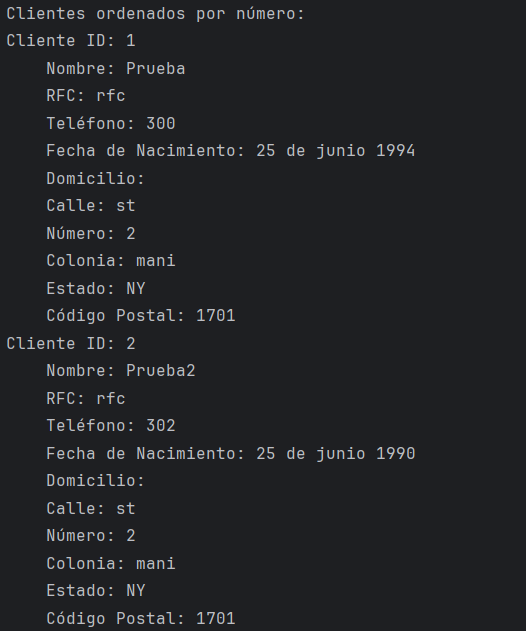
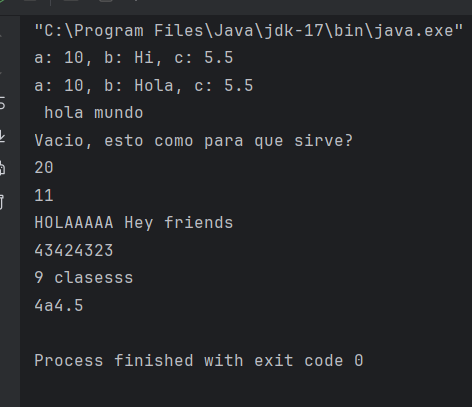
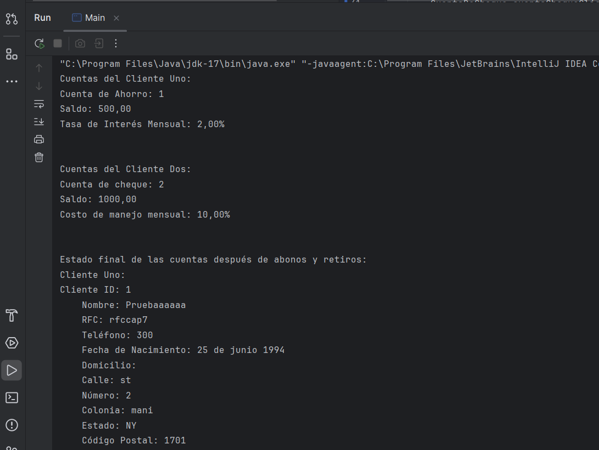
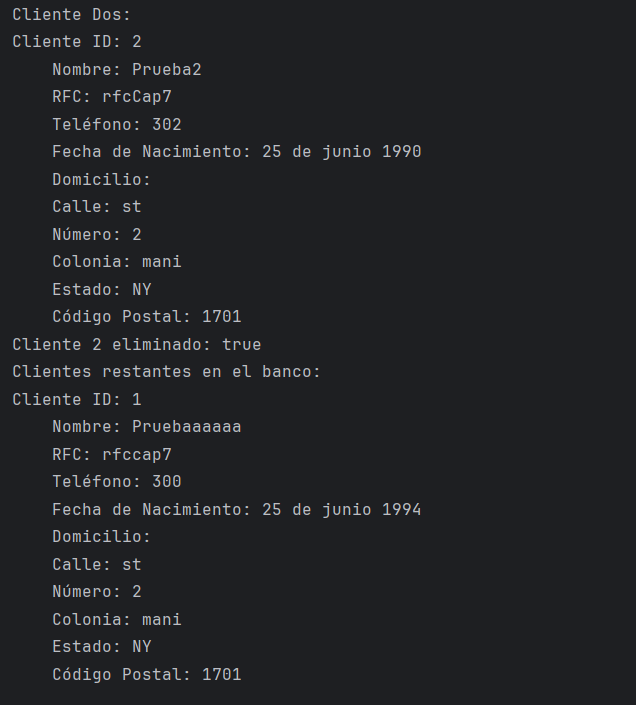
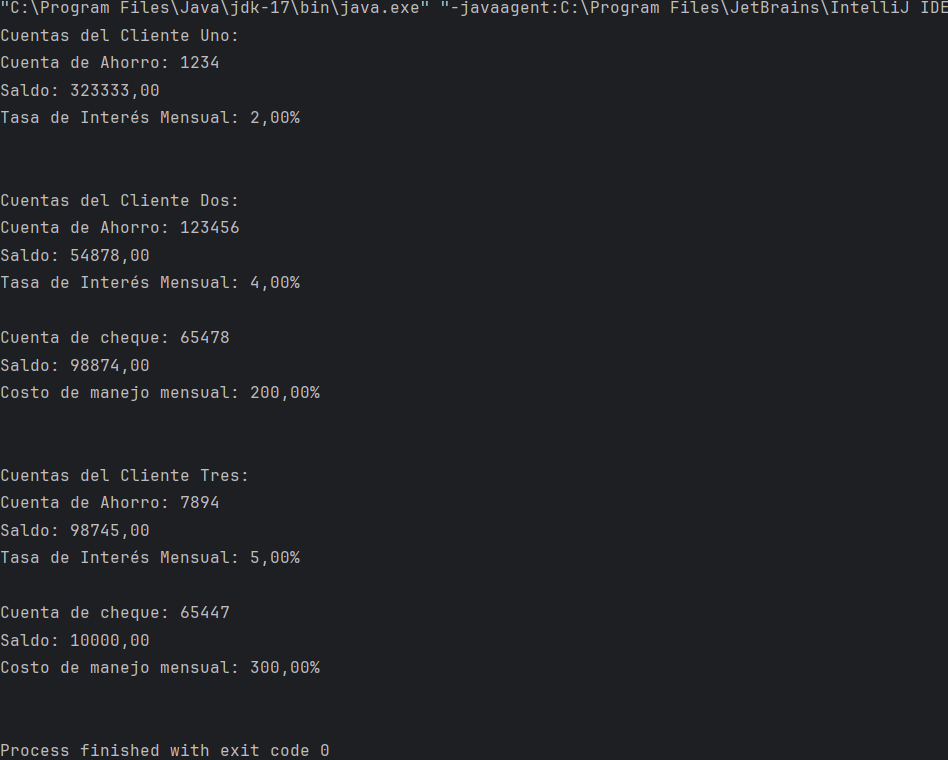
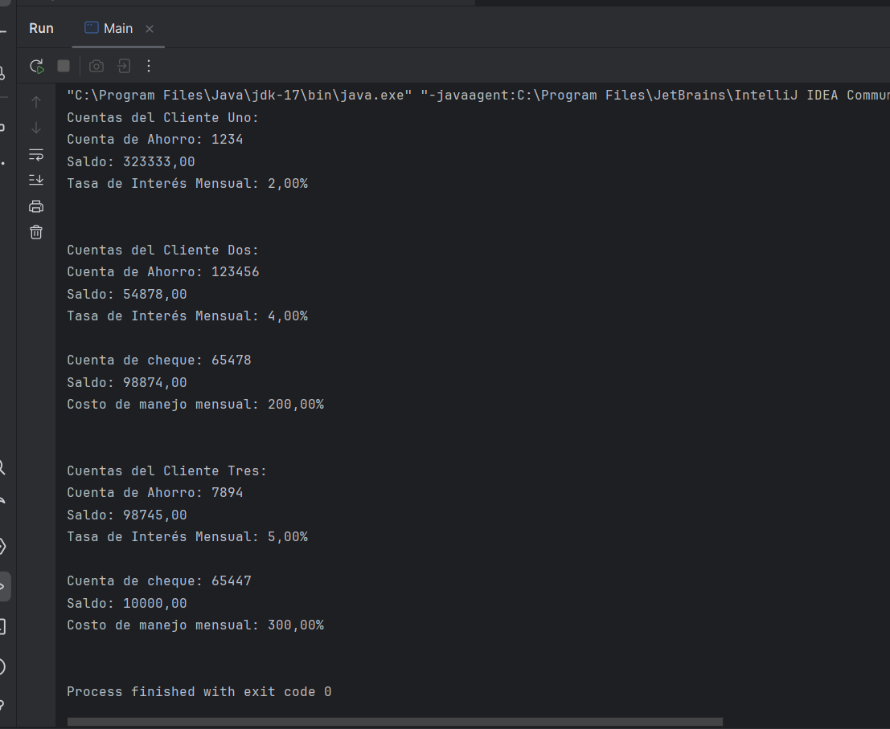

El proyecto CursoJava esta divido en tres modulos, en la carpeta clases encontramos
1. enLinea
2. entregables
3. practicas

En 1. enLinea, encontramos ejercicios realizados en clase directamente.

En 2. entregables, encontramos los ejercicios solicitados a modos de entregables de las diapositivas y los ejercicios propuestos por el docente.

En 3. practicas, encontramos los ejercicios que son de practica por ahora los ejercicios For.

Así es como se ve la salida por consola de cada capitulo
Entregables capitulo 1 y 2:

Capitulo 3:

Actividad de ordenamiento

Capitulo 6:
Adjunto evidencia de la salida por consola

Capitulo 7: 
Adjunto evidencia de la salida por consola cap 7

Capitulo 8: 

Capitulo 10: 
Salida por consola con implementación de hilos, cabe recalcar que fue mucho más rápida la ejecución
