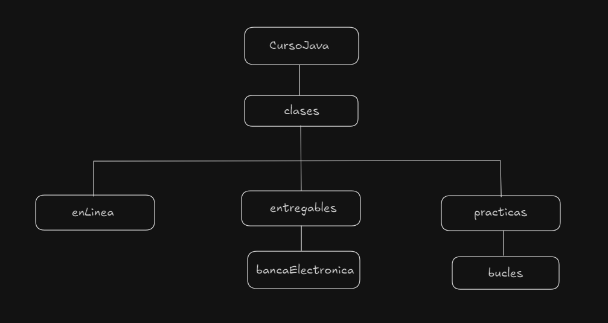
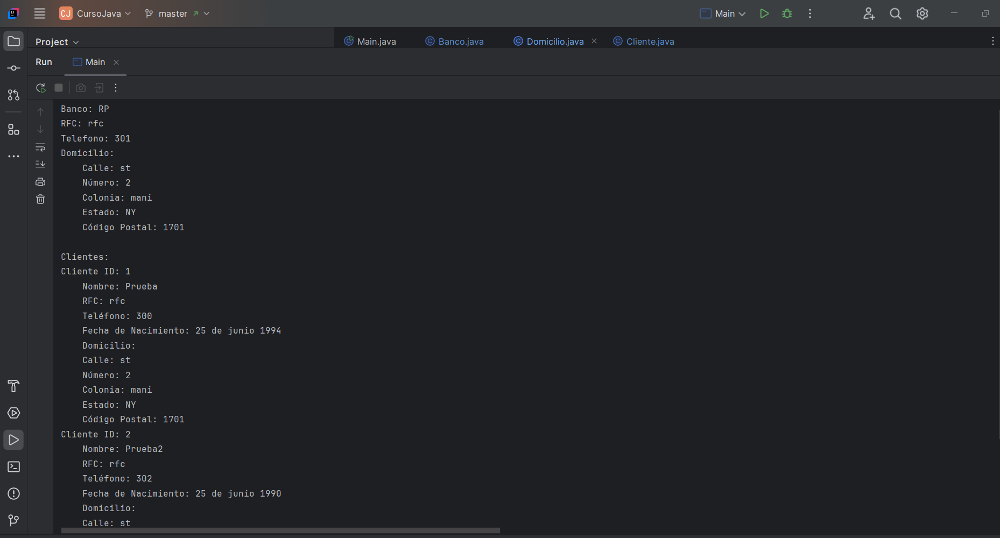

El proyecto CursoJava esta divido en tres modulos, en la carpeta clases encontramos
1. enLinea
2. entregables
3. practicas

En 1. enLinea, encontramos ejercicios realizados en clase directamente.

En 2. entregables, encontramos los ejercicios solicitados a modos de entregables de las diapositivas y los ejercicios propuestos por el docente.

En 3. practicas, encontramos los ejercicios que son de practica por ahora los ejercicios For.

Así es como se ve la salida por consola de cada capitulo
Entregables capitulo 1:

